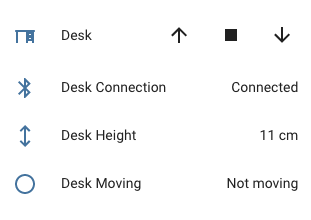

This project is archived as Idasen Desk is now compatbile with Home Assistant and ESPHome Bluetooth Proxy (https://www.home-assistant.io/integrations/idasen_desk/).
-------------

This component creates a bluetooth bridge for an [Ikea Idasen](https://www.ikea.com/gb/en/p/idasen-desk-sit-stand-brown-dark-grey-s19280958/) desk that uses a Linak controller with [ESPHome](https://esphome.io) and an [ESP32 device](https://esphome.io/devices/esp32.html).

| [Cover integration](https://www.home-assistant.io/integrations/cover/) | [Linak Desk Card](https://github.com/IhorSyerkov/linak-desk-card)                                                              |
| ---------------------------------------------------------------------- | ------------------------------------------------------------------------------------------------------------------------------ |
|               |  |

The desk is controlled using the [cover integration](https://www.home-assistant.io/integrations/cover/) or [Linak Desk Card](https://github.com/IhorSyerkov/linak-desk-card) which is available in [HACS](https://hacs.xyz) in Home assistant.

## Dependencies

* This component requires an [ESP32 device](https://esphome.io/devices/esp32.html).
* [ESPHome 2021.10.0 or higher](https://github.com/esphome/esphome/releases).

## Installation

You can install this component with [ESPHome external components feature](https://esphome.io/components/external_components.html) like this:
```
external_components:
  - source: github://j5lien/esphome-idasen-desk-controller@v4.0.0
```

For the first connection you will need to press the pairing button on the desk.

## Configuration

### BLE Client

You need first to configure [ESPHome BLE Client](https://esphome.io/components/ble_client.html) (check the documentation for more information):

```yaml
esp32_ble_tracker:

ble_client:
  - mac_address: "00:00:00:00:00:00" # Replace with the desk bluetooth mac address
    id: idasen_desk
```

> On OSX, you can find the mac address of the desk by first connecting to it using a supported app (like [Idasen Controller](https://github.com/DWilliames/idasen-controller-mac) or [Desk Remote Control](https://apps.apple.com/us/app/desk-remote-control/id1509037746)), and then running this command in terminal:
`system_profiler SPBluetoothDataType`

### Idasen Desk Controller

Then you need to enable this component with the id of the ble_client component:

```yaml
idasen_desk_controller:
    # Reference to the ble client component id
    # -----------
    # Required
    ble_client_id: idasen_desk
    # Fallback to use only up and down commands (less precise)
    # -----------
    # Optional
    only_up_down_command: false
```

### Cover

Now you can add the cover component that will allow you to control your desk:

```yaml
cover:
  - platform: idasen_desk_controller
    name: "Desk"
```

### Extra Desk informations

Using [ESPHome BLE Client Sensor](https://esphome.io/components/sensor/ble_client.html), you can expose more informations that doesn't require this custom component.

This is an example that generates sensors that were available in previous versions:

```yaml
esp32_ble_tracker:

globals:
  # To store the Desk Connection Status
  - id: ble_client_connected
    type: bool
    initial_value: 'false'

ble_client:
  - mac_address: "00:00:00:00:00:00"
    id: idasen_desk
    on_connect:
      then:
        # Update the Desk Connection Status
        - lambda: |-
            id(ble_client_connected) = true;
        - delay: 5s
        # Update desk height and speed sensors after bluetooth is connected
        - lambda: |-
            id(desk_height).update();
            id(desk_speed).update();
    on_disconnect:
      then:
        # Update the Desk Connection Status
        - lambda: |-
            id(ble_client_connected) = false;

sensor:
  # Desk Height Sensor
  - platform: ble_client
    type: characteristic
    ble_client_id: idasen_desk
    id: desk_height
    name: 'Desk Height'
    service_uuid: '99fa0020-338a-1024-8a49-009c0215f78a'
    characteristic_uuid: '99fa0021-338a-1024-8a49-009c0215f78a'
    icon: 'mdi:arrow-up-down'
    unit_of_measurement: 'cm'
    accuracy_decimals: 1
    update_interval: never
    notify: true
    lambda: |-
      uint16_t raw_height = ((uint16_t)x[1] << 8) | x[0];
      unsigned short height_mm = raw_height / 10;

      return (float) height_mm / 10;

  # Desk Speed Sensor
  - platform: ble_client
    type: characteristic
    ble_client_id: idasen_desk
    id: desk_speed
    name: 'Desk Speed'
    service_uuid: '99fa0020-338a-1024-8a49-009c0215f78a'
    characteristic_uuid: '99fa0021-338a-1024-8a49-009c0215f78a'
    icon: 'mdi:speedometer'
    unit_of_measurement: 'cm/min' # I'm not sure this unit is correct
    accuracy_decimals: 0
    update_interval: never
    notify: true
    lambda: |-
      uint16_t raw_speed = ((uint16_t)x[3] << 8) | x[2];
      return raw_speed / 100;

binary_sensor:
  # Desk Bluetooth Connection Status
  - platform: template
    name: 'Desk Connection'
    id: desk_connection
    lambda: 'return id(ble_client_connected);'

  # Desk Moving Status
  - platform: template
    name: 'Desk Moving'
    id: desk_moving
    lambda: 'return id(desk_speed).state > 0;'
```

## Troubleshooting

### ESPHome lower than 1.19.0

Check the version [v1.2.4](https://github.com/j5lien/esphome-idasen-desk-controller/releases/tag/v1.2.4) of this component

### Not moving using cover component

If the desk is not moving using the cover component you can try to activate a fallback option `only_up_down_command`. It will only use up and down commands to control the desk height, it is less precise when you specify a target position.

```yaml
idasen_desk_controller:
    ble_client_id: idasen_desk
    only_up_down_command: true
```

### Wifi deconnexion

If you experience Wifi deconnexion, try to activate the [wifi fast connect](https://esphome.io/components/wifi.html) option.
```yaml
wifi:
  ssid: ...
  password: ...
  fast_connect: true
```

You can also try to set the [power save mode](https://esphome.io/components/wifi.html?highlight=wifi#power-save-mode) option to `none`.
```yaml
wifi:
  ssid: ...
  password: ...
  fast_connect: true
  power_save_mode: none
```

## References

* https://github.com/TheRealMazur/LinakDeskEsp32Controller
* https://esphome.io/components/ble_client.html
* https://esphome.io/components/sensor/ble_client.html
